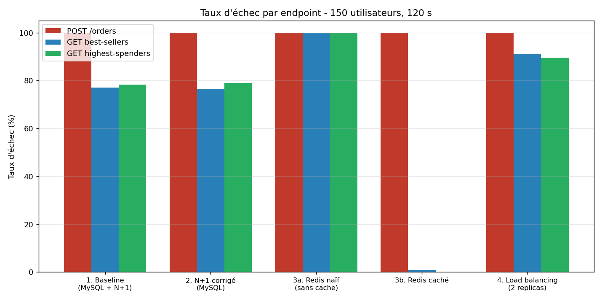
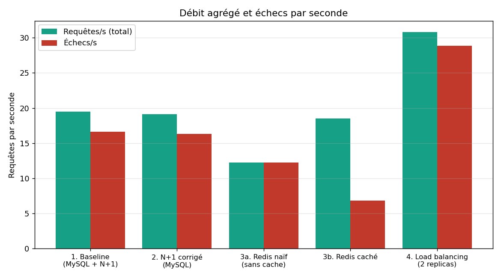
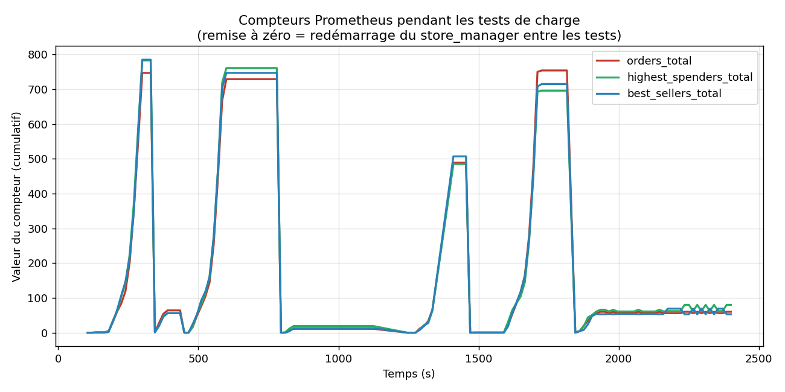
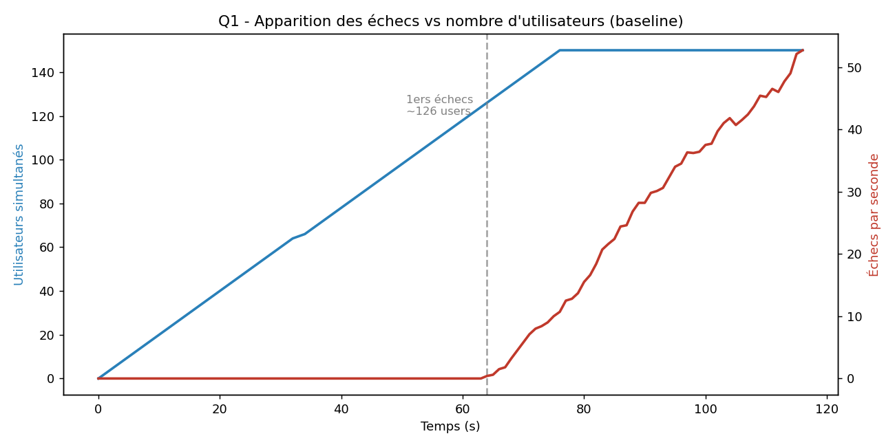
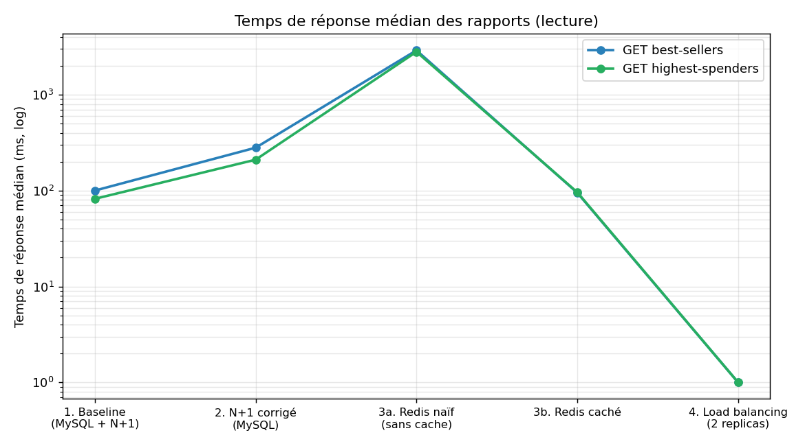
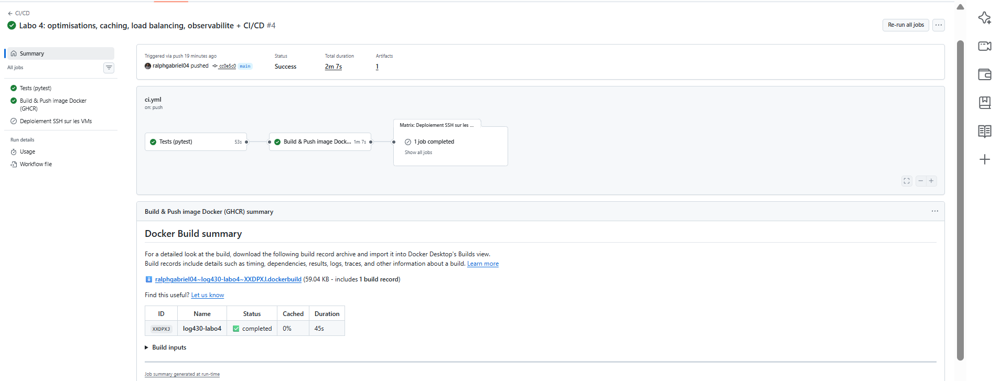

# Rapport - Laboratoire 04
## Optimisation, Caching, Load Balancing, Test de charge et Observabilité

**LOG430-02 — Architecture logicielle, École de technologie supérieure (ÉTS)**

<p>
<strong>Chargé de laboratoire :</strong> Gabriel C. Ullmann<br/>
<strong>Étudiant :</strong> Ralph Christian Gabriel<br/>
<strong>Code permanent :</strong> GABR77340401<br/>
<strong>Session :</strong> Été 2026<br/>
<strong>Application :</strong> Store Manager (suite du Labo 03)<br/>
<strong>Date des mesures :</strong> 2026-06-10
</p>

---

## 1. Environnement de test

| Élément | Valeur |
|---------|--------|
| Machine | Windows 11, Docker Desktop (WSL2) |
| Conteneurs | `store_manager` (Flask), `mysql:8.4.7`, `redis:7`, `prom/prometheus`, `locustio/locust`, `nginx:latest` |
| Jeu de données | 1 000 utilisateurs, 10 000 produits, 80 000 commandes (240 483 articles) |
| Paramètres Locust | **150 utilisateurs**, spawn rate **2/s**, durée **120 s** |
| Réseau | `labo04-network` (bridge Docker) |

> **Note méthodologique.** Tous les tests ont été exécutés en mode *headless* avec
> Locust (`locust --headless -u 150 -r 2 -t 120s --csv ... --html ...`), ce qui produit
> exactement les mêmes mesures que l'interface web (les 4 métriques d'or de Google) mais
> de façon reproductible. Les fichiers CSV bruts sont dans `locustfiles/` et les rapports
> HTML interactifs (`test*_*.html`) accompagnent ce rapport.

---

## 2. Tableau de synthèse des 5 tests de charge

Mesures agrégées (150 utilisateurs, 120 s) :

| Test | Configuration | Requêtes | Échecs | % échec | Méd. (ms) | Req/s |
|------|---------------|----------|--------|---------|-----------|-------|
| **1** | Baseline (MySQL + N+1) | 2 319 | 1 978 | **85.3 %** | 54 | 19.5 |
| **2** | N+1 corrigé (MySQL) | 2 279 | 1 949 | **85.5 %** | 100 | 19.1 |
| **3a** | Redis naïf (sans cache) | 1 457 | 1 457 | **100 %** | 3 200 | 12.2 |
| **3b** | Redis caché | 2 211 | 815 | **36.9 %** | 84 | 18.5 |
| **4** | Load balancing (2 replicas) | 3 684 | 3 451 | **93.7 %** | 1 | 30.8 |

Détail par endpoint :

| Test | Endpoint | Req | Échecs | % | Méd (ms) | Moy (ms) |
|------|----------|-----|--------|---|----------|----------|
| 1 | POST /orders | 794 | 793 | 99.9 | 22 | 8 339 |
| 1 | GET best-sellers | 762 | 588 | 77.2 | 100 | 281 |
| 1 | GET highest-spenders | 763 | 597 | 78.2 | 82 | 171 |
| 2 | POST /orders | 793 | 793 | 100 | 24 | 8 557 |
| 2 | GET best-sellers | 734 | 562 | 76.6 | 280 | 388 |
| 2 | GET highest-spenders | 752 | 594 | 79.0 | 210 | 300 |
| 3a | POST /orders | 478 | 478 | 100 | 4 200 | 8 192 |
| 3a | GET best-sellers | 498 | 498 | 100 | 2 900 | 6 026 |
| 3a | GET highest-spenders | 481 | 481 | 100 | 2 800 | 6 438 |
| 3b | POST /orders | 809 | 809 | 100 | 24 | 9 127 |
| 3b | GET best-sellers | 710 | **5** | **0.7** | 95 | 102 |
| 3b | GET highest-spenders | 692 | **1** | **0.1** | 96 | 104 |
| 4 | POST /orders | 1 274 | 1 274 | 100 | 1 | 5 276 |
| 4 | GET best-sellers | 1 197 | 1 091 | 91.1 | 1 | 3.9 |
| 4 | GET highest-spenders | 1 213 | 1 086 | 89.5 | 1 | 4.3 |





---

## 3. Observabilité avec Prometheus (Activités 2-4)

### 3.1 Endpoint `/metrics` et Counters

Trois `Counter` ont été ajoutés dans `src/store_manager.py`, incrémentés à chaque
requête, et exposés via l'endpoint `/metrics` :

```python
from prometheus_client import Counter, generate_latest, CONTENT_TYPE_LATEST

counter_orders          = Counter('orders', 'Total calls to /orders')
counter_highest_spenders = Counter('highest_spenders', 'Total calls to /orders/reports/highest-spenders')
counter_best_sellers     = Counter('best_sellers', 'Total calls to /orders/reports/best-sellers')

@app.post('/orders')
def post_orders():
    counter_orders.inc()
    return create_order(request)

@app.route("/metrics")
def metrics():
    return generate_latest(), 200, {"Content-Type": CONTENT_TYPE_LATEST}
```

`prometheus.yml` configure le scraping toutes les 5 s de la cible `store_manager:5000`.
La cible apparaît **UP** dans Prometheus (`/api/v1/targets`), et les variables
`orders_total`, `highest_spenders_total`, `best_sellers_total` sont interrogeables.

### 3.2 Visualisation des compteurs

Le graphique ci-dessous montre l'évolution réelle des 3 compteurs pendant les 5 tests de
charge. Chaque « bosse » correspond à un test ; les remises à zéro correspondent au
redémarrage du `store_manager` entre chaque test (les `Counter` vivent en mémoire du
processus). On observe que les 3 compteurs montent de façon quasi identique, ce qui est
cohérent avec la proportion 1:1:1 du locustfile.



> **Pourquoi l'observabilité ?** La mesure n'est pas qu'une affaire de développeurs : avec
> Grafana branché sur Prometheus, toute l'équipe peut suivre l'état de l'application et
> décider quoi optimiser. Dans ce labo, c'est précisément la mesure qui révèle que Redis
> « naïf » est plus lent que MySQL (contre-intuitif) et que le load balancing local
> n'aide pas.

---

## 4. Activité 5 - Test de charge baseline

Configuration : rapports lus depuis **MySQL** (Redis désactivé), problème **N+1 présent**.

### Q1 - Combien d'utilisateurs avant que le Store Manager commence à échouer ?

D'après le `stats_history.csv` du test baseline, les **premiers échecs apparaissent
autour de ~120-126 utilisateurs simultanés** (≈ 64 s après le début, pendant la montée
en charge). Avant ce point, 0 échec ; après, le taux d'échec grimpe en flèche et ne
redescend jamais — l'application a atteint sa limite de capacité.



### Q2 - Combien d'endpoints échouent plus de 50 % du temps ?

**Les 3 endpoints** dépassent 50 % d'échec :

| Endpoint | % échec |
|----------|---------|
| POST /orders | 99.9 % |
| GET best-sellers | 77.2 % |
| GET highest-spenders | 78.2 % |

### Q3 - Les messages d'erreur indiquent une défaillance dans quelle partie ?

Exemples de messages relevés dans l'onglet *Failures* / les logs Locust :

```
POST /orders: Erreur 500 - (mysql.connector.errors.OperationalError)
              1040 (08004): Too many connections
POST /orders: Erreur 500 - (mysql.connector.errors.DatabaseError)
              1040 (HY000): Too many connections
GET  /orders/reports/best-sellers: Erreur 500 - Internal Server Error
POST /orders: RetriesExceeded(... original=timed out)
```

La défaillance vient de **MySQL** : l'erreur `1040 Too many connections` montre que la
base atteint son plafond de connexions (`max_connections` ≈ 151). Redis n'est pas en
cause ici (il est désactivé). Le problème se propage ensuite à la couche **Python/Flask**
qui renvoie des 500. **Ce n'est donc pas un problème applicatif de logique, mais un
épuisement des connexions à la base de données**, aggravé par le fait que
`get_sqlalchemy_session()` crée un **nouveau moteur SQLAlchemy à chaque appel**.

---

## 5. Activité 6 - Élimination du problème N+1

Correction dans `src/orders/commands/write_order.py` : au lieu d'une requête par article
(boucle), on récupère tous les produits en **une seule requête** avec `IN` :

```python
# AVANT (N+1) : une requête par product_id dans une boucle
# APRÈS :
unique_product_ids = list(set(product_ids))
products = session.query(Product).filter(Product.id.in_(unique_product_ids)).all()
for product in products:
    product_prices[product.id] = product.price
```

### Q4 - Différences sur POST /orders entre test 1 et test 2 ?

**Quasiment aucune différence mesurable** sur POST /orders :

| Métrique | Test 1 (N+1) | Test 2 (corrigé) |
|----------|--------------|------------------|
| Requêtes | 794 | 793 |
| % échec | 99.9 % | 100 % |
| Médiane | 22 ms | 24 ms |
| Moyenne | 8 339 ms | 8 557 ms |

**Pourquoi ?** Deux raisons : (1) dans le locustfile, chaque commande ne contient que
**1 à 5 articles** — le surcoût N+1 est donc minime (au pire 5 requêtes au lieu d'1) ;
(2) surtout, le **vrai goulot d'étranglement n'est pas le nombre de requêtes mais
l'épuisement des connexions MySQL**. Tant que ce plafond est atteint, réduire le nombre
de requêtes par commande ne change pas le résultat global. L'optimisation N+1 reste
néanmoins correcte et indispensable à plus grande échelle (voir Q5).

### Q5 - Avec 1 M de produits ou plus d'articles par commande ?

- **Plus d'articles par commande :** le temps de réponse de la version **non optimisée
  augmenterait linéairement** (N requêtes pour N articles), alors que la version
  **optimisée reste quasi constante** (1 seule requête `IN`, peu importe le nombre
  d'articles). C'est là que l'optimisation N+1 prend toute sa valeur.
- **1 M de produits dans la base :** comme les recherches se font sur la clé primaire
  (indexée), passer de 10 k à 1 M de produits a un impact faible sur une **requête
  unique** ; mais avec le N+1, faire N lookups indexés reste N fois plus coûteux en
  allers-retours réseau/latence. Le facteur déterminant est donc surtout le **nombre
  d'articles par commande**, pas la taille de la table.

---

## 6. Activité 7 - Cache des rapports avec Redis

### 6.1 Étape a - Redis « naïf » (sans cache de rapport)

On réactive les versions Redis qui scannent toutes les clés `order:*` à chaque requête
(`r.keys("order:*")` puis `r.hgetall(key)` pour 80 000 commandes). Résultat (test 3a) :
**catastrophique** — 100 % d'échec sur tous les endpoints, médiane à **3 200 ms**.

Bien que Redis soit en mémoire (accès rapide), parcourir 80 000 clés et désérialiser
chaque commande **à chaque requête HTTP** sature le processus Python. Le débit chute de
19 → 12 req/s. **C'est plus lent que MySQL** (qui fait l'agrégation côté base avec
`GROUP BY` sur des colonnes indexées).

### 6.2 Étape b - Cache du rapport rendu (code de `/optimization`)

On met en cache le **rapport déjà calculé** dans Redis (`report:highest_spenders`,
`report:best_sellers`). Le rapport est pré-généré au démarrage puis **rafraîchi toutes
les 60 s** par un timer, ce qui évite le *cache stampede* (l'ancien rapport est servi
tant que le nouveau n'est pas prêt) :

```python
def generate_reports_and_cache():
    threading.Timer(2.0, get_report_highest_spending_users, args=(True,)).start()
    threading.Timer(2.0, get_report_best_selling_products,  args=(True,)).start()
    threading.Timer(60.0, generate_reports_and_cache).start()
generate_reports_and_cache()
```

Les endpoints ne font plus que **lire le rapport déjà rendu** (`skip_cache=False`), une
seule opération `GET` Redis.

### Q6 - Différences significatives vs test précédent ?

**Amélioration spectaculaire** sur les lectures :

| Endpoint | Test 3a (naïf) | Test 3b (caché) | Gain |
|----------|----------------|-----------------|------|
| best-sellers - médiane | 2 900 ms | **95 ms** | **-96.7 %** |
| best-sellers - % échec | 100 % | **0.7 %** | quasi nul |
| highest-spenders - médiane | 2 800 ms | **96 ms** | **-96.6 %** |
| highest-spenders - % échec | 100 % | **0.1 %** | quasi nul |
| Agrégé - % échec | 100 % | **36.9 %** | -63 pts |

Comparé même au **MySQL** (test 2 : best-sellers 280 ms / 76.6 % d'échec), le cache Redis
est **~3× plus rapide en médiane et passe de 77 % à <1 % d'échec**. La génération des
rapports ne touche plus MySQL, ce qui le décharge.



### Q7 - Qu'est-ce qui limite encore POST /orders ?

Même avec les rapports servis par Redis, **POST /orders reste à 100 % d'échec**. Ce qui
le limite :

1. **L'écriture est synchrone et passe par MySQL** (INSERT order + order_items + mise à
   jour du stock, dans une transaction).
2. **Une connexion/un moteur SQLAlchemy est créé par requête** (`get_sqlalchemy_session()`
   appelle `create_engine()` à chaque fois) → sous 150 utilisateurs, MySQL atteint
   `max_connections` (`1040 Too many connections`) et les connexions fuient.
3. **Le serveur Flask de développement** est mono-processus : il ne peut pas absorber un
   tel nombre d'écritures concurrentes.

Bref, **la base de données (et la gestion des connexions) est le goulot d'étranglement
des écritures**. Le cache aide les lectures mais ne change rien aux écritures.

---

## 7. Activité 8 - Load balancing avec Nginx

### 7.1 Configuration testée (scenario_82, local)

Nginx + **2 replicas** de `store_manager`, Locust pointant vers `nginx:80`. `nginx.conf` :

```nginx
http {
  upstream store_manager_nginx {
    least_conn;
    server store_manager:5000;   # Docker DNS -> les 2 replicas
  }
  server {
    listen 80;
    location / { proxy_pass http://store_manager_nginx; }
  }
}
```

Nginx a bien réparti la charge : les **2 replicas ont servi un nombre quasi égal de
requêtes** (≈ 140 vs 137 lignes de log applicatif), confirmant l'équilibrage.

### Q8 - Différences vs test précédent ? Amélioration ou détérioration ?

Résultat **nuancé et instructif** :

| Métrique agrégée | Test 3b (1 instance) | Test 4 (2 replicas) | Variation |
|------------------|----------------------|---------------------|-----------|
| Requêtes totales | 2 211 | 3 684 | **+66 %** |
| Débit (req/s) | 18.5 | 30.8 | **+66 %** |
| % échec | 36.9 % | **93.7 %** | **fortement pire** |
| Lectures % échec | ~0.5 % | ~90 % | pire |

Le **débit brut augmente** (2 instances acceptent plus de connexions), mais le **débit
utile s'effondre** : les lectures, qui réussissaient à >99 % avec le cache, échouent
maintenant à ~90 %. Les logs Nginx expliquent pourquoi :

```
[error] no live upstreams while connecting to upstream
[error] upstream timed out (110) while reading response header
"GET /orders/reports/highest-spenders" 502
"POST /orders" 504
```

**Mécanisme :** POST /orders sature chaque replica (écritures + fuite de connexions MySQL).
Les replicas deviennent non réactifs ; Nginx (health-check passif) les marque **DOWN** et
renvoie alors **502 « no live upstreams » pour TOUTES les requêtes**, y compris les
lectures pourtant rapides. La médiane de 1 ms en test 4 reflète des **502 renvoyés
instantanément**, pas des succès rapides.

**Conclusion :** sur **une seule machine**, le load balancing **n'améliore pas** la
performance et **dégrade la fiabilité**, car (1) les 2 replicas se partagent le même
CPU/RAM et (2) surtout **la même base MySQL**, qui reste le vrai goulot. Comme l'indique
l'énoncé, un gain réel nécessite **2 VMs distinctes** (scenario_81) afin que chaque
instance dispose de ses propres ressources de calcul — mais MySQL resterait un point de
contention partagé pour les écritures. La configuration `nginx.conf` prête pour 2 VMs est
fournie dans `load-balancer-config/scenario_81/nginx.conf`.

### Q9 - Quelle politique d'équilibrage de charge utilisons-nous ?

**`least_conn`** (least connections) : Nginx envoie chaque nouvelle requête au serveur
amont qui a le **moins de connexions actives**. C'est adapté à des requêtes de durées
inégales (nos POST lents vs GET rapides), contrairement au round-robin par défaut qui
distribue aveuglément.

---

## 8. Intégration CI/CD et conteneurisation

Le pipeline `.github/workflows/ci.yml` est **automatisé** (déclenché sur `push` vers
`main`/`master`, sur `pull_request` et manuellement via `workflow_dispatch`) et comporte
**3 étapes** :

```
push / PR
   │
   ▼
┌──────────────┐   needs   ┌────────────────────────┐   needs   ┌───────────────────────┐
│ 1. test       │─────────▶│ 2. build-and-push       │─────────▶│ 3. deploy              │
│ pytest +      │          │ Docker build → GHCR     │          │ SSH sur les 2 VMs      │
│ MySQL + Redis │          │ (tags: latest + sha)    │          │ docker compose up -d   │
└──────────────┘           └────────────────────────┘           └───────────────────────┘
```

1. **`test`** — démarre des services `mysql:8.4.7` + `redis:7`, installe les
   dépendances, crée le `.env`, initialise le schéma (`db-init/00_init.sql`) puis lance
   **`pytest`** (`src/tests/test_store_manager.py` : health-check + flux complet
   produit → stock → commande).
2. **`build-and-push`** — construit l'image Docker (le `Dockerfile` du projet) et la
   **pousse sur GitHub Container Registry** (`ghcr.io/<repo>/store_manager:latest` et
   `:<sha>`), avec cache de build GitHub Actions. C'est le volet **conteneurisation**.
3. **`deploy`** — **automation de déploiement** : sur `push` vers `main`, se connecte en
   SSH (matrix sur les 2 VMs `10.194.32.67` et `10.194.32.68`) et exécute
   `git pull && docker compose pull && docker compose up -d --build`. Activé par la
   variable de dépôt `ENABLE_DEPLOY` + les secrets `VM_SSH_USER` / `VM_SSH_KEY` ; pour
   atteindre le réseau privé ÉTS (`10.194.x.x`), un *runner* self-hosted ou un accès VPN
   est requis (sinon le job est ignoré pour garder le pipeline vert).

> Le pipeline n'est **pas identique au gabarit** (qui se contentait d'un `echo` à la place
> de pytest) : tests réels, build d'image et déploiement automatisé ont été ajoutés.

### 8.1 Exécution réelle du pipeline

Le pipeline s'exécute avec **succès** sur GitHub Actions (durée totale ≈ 2 min) :
`Tests (pytest)` ✅ → `Build & Push image Docker (GHCR)` ✅ → `Deploiement SSH` (ignoré
car `ENABLE_DEPLOY` non défini). L'image `store_manager` est construite et publiée sur
GHCR à chaque push sur `main`.



> Diagnostic via CI : le premier run a révélé que les `threading.Timer` du cache de
> rapports (non-daemon) empêchaient `pytest` de se terminer (job bloqué 19 min). Correctif
> appliqué : `daemon=True` sur les timers. C'est un exemple concret de l'utilité du
> pipeline pour détecter des problèmes invisibles en local.

---

## 9. Points clés à retenir

1. **La mesure est fondamentale.** Sans Locust + Prometheus, impossible de savoir que
   Redis « naïf » est *plus lent* que MySQL (test 3a), ou que le load balancing local
   *dégrade* la fiabilité (test 4). L'intuition ne suffit pas.
2. **Les optimisations ont des effets de bord.** Le cache Redis améliore énormément les
   lectures (test 3b) mais ne change rien aux écritures. Le load balancing augmente le
   débit brut mais effondre le débit utile sur une seule machine.
3. **La base de données est le goulot d'étranglement** d'une application monolithique et
   synchrone comme Store Manager. L'ordre rationnel : optimiser le code (N+1, cache) →
   scaling vertical → scaling horizontal (load balancing sur VMs distinctes) → changement
   d'architecture (microservices événementiels).
4. **POST /orders reste le maillon faible** dans tous les scénarios : écritures
   synchrones + une connexion MySQL par requête = épuisement de `max_connections`.

---

## Annexes

- `locustfiles/test*_stats.csv` — statistiques brutes des 5 tests.
- `locustfiles/test*.html` — rapports HTML interactifs Locust (graphiques temps réel).
- `docs/captures/*.png` — graphiques générés (`scripts/generate_charts.py`).
- `load-balancer-config/scenario_81/nginx.conf` — config Nginx prête pour 2 VMs.
- `.github/workflows/ci.yml` — pipeline CI/CD.
